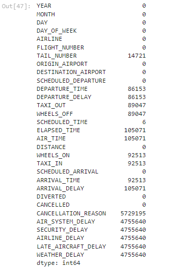

# LHL-Midterm-Project


## Project/Goals
The goal of this project was to analyze a flight data set that housed information including, but not limited to measures like arrival and dearture times, departure and arrival delays, distance, airline, destination and origin airport, and predict which would be contributing factors to a flight delay. We took advantage of using a classification model with xgboost to try and accurately predict this. 


## Process

#### 1.Identified Target Dataset
The comprehensive data set was acquired from https://www.kaggle.com/datasets/usdot/flight-delays/data for US flights in 2015 and gave us over five million rows of total data to work with. There was high confidence that there would be sufficient informaton to test our predictions and achieve high accuracy.

#### 2.Conduct EDA
##### Cleaned data and One-hot encoded target variables
``` python
#Check which columns have too many rows of empty data

flights.isna().sum()
```


``` python
#Based on analysis above, we can remove the columns below as they are mostly blank and will delete the entire dataset of we clean all columns without data. Also removing columns such as "Airline", "Origin Airport", "Destination Airport", and "Tail Number" such those aren't numerical and cannot be part of EDA

columns_to_drop = ['AIRLINE', 'ORIGIN_AIRPORT', 'DESTINATION_AIRPORT', 'TAIL_NUMBER', 'CANCELLATION_REASON', 'AIR_SYSTEM_DELAY', 'SECURITY_DELAY', 'AIRLINE_DELAY', 'LATE_AIRCRAFT_DELAY', 'WEATHER_DELAY', 'DEPARTURE_TIME']
flights.drop(columns = columns_to_drop, inplace = True)
```


#### 3.Built Basic & Advanced Classification Models
```python
#Import 2015 flight data from CSV file

dtype_options = {'AIRLINE': 'object', 'TAIL_NUMBER': 'object', 'ORIGIN_AIRPORT': 'object', 'DESTINATION_AIRPORT': 'object'}
flights = pd.read_csv('Data/flights.csv', dtype = dtype_options)

#Create final feature set based on testing parameters for full model evaluation
flights_final = flights[['ARRIVAL_DELAY', 'SCHEDULED_DEPARTURE', 'DISTANCE', 'DAY_OF_WEEK', 'MONTH']]

#Confirm no missing values or datatype errors are present
flights_final.isna().sum()

#Create feature set for independent variable
ffx = flights_final[['SCHEDULED_DEPARTURE', 'DISTANCE', 'DAY_OF_WEEK', 'MONTH']]

#Create output set for dependent variable
ffy = flights_final['ARRIVAL_DELAY']

#Create new DataFrame for dependent variable
ffy = pd.DataFrame(ffy)

#Classify flights as late if their arrival delay time is > 0 minutes (Value = 1) otherwise if on-time or early (Value = 0)
ffy['IS_LATE'] = (ffy['ARRIVAL_DELAY'] > 0).astype(int)

#Check head of file to confirm flights with negative arrival delays are classified as 0 and flights with positive values are classified as 1
ffy.head()

#Drop "Arrival Delay" column from analysis
ffy = ffy['IS_LATE']

#Split the data into training and testing sets to validate approach
X_train, X_test, y_train, y_test = train_test_split(ffx, ffy, test_size=0.2, random_state=42)

#Initialize and train an XGBoost classifier
model = XGBClassifier()
model.fit(X_train, y_train)

#Make predictions on the test set
y_pred = model.predict(X_test)

#Evaluate the model accuracy
accuracy = accuracy_score(y_test, y_pred)
classification_report_result = classification_report(y_test, y_pred)

#Display model accuracy and classification report results
print(f"Accuracy: {accuracy:.2f}")
print("Classification Report:")
print(classification_report_result)

#Show feature based on features to determine which features impact prediction results
feature_importance = pd.DataFrame({'Feature': ffx.columns, 'Importance': model.feature_importances_})
print("\nFeature Importance:")
print(feature_importance.sort_values(by='Importance', ascending=False))
```


#### 4.Test & Validated Model Results


#### 5.Connected in Tableau and Created Dashboards to Support Model 


## Results
The output of our classification model indicated that it is able to correctly predict flight delays 65% of the time.
- The time at which a flight is scheduled to depart is the most influential factor in predicting flight delays.
- If the scheduled departure time is later in the day or during peak hours, it could contribute to a higher likelihood of delays.
- The time at which a flight is scheduled to depart is the most influential factor in predicting flight delays.
- If the scheduled departure time is later in the day or during peak hours, it could contribute to a higher likelihood of delays.
- The day of the week when a flight is scheduled plays a role in predicting delays.
- Flights scheduled on certain days, possibly weekends or weekdays, might be more prone to delays. This could be influenced by factors like increased air traffic on specific days or different operational schedules.
- The distance between the departure and arrival locations also contributes to predicting flight delays.
- Longer flights might have different operational considerations or potential for delays compared to shorter flights. Factors like layovers or different airport conditions could influence this.

  Understanding these factors can help in making informed decisions, such as avoiding peak departure times or being cautious during certain months, to minimize the risk of flight delays.

## Challenges 
Initially tasked with acquiring data from an API, we found it to have too many limitations to be able to grab and analyze the data given the projects time constraints. We still came across challenges like redundant variables, our dataset being too large for model building, one-hot encoding exponentially expanded the dataset and out prediction accuracy was below our expectations. This was solved through dropping the redundant variables, taking 10% random sample of the data for exploratory model building, utilized Pandas "Get Dummies" sucessfully. and performed hyperparameter tuning.


## Future Goals
